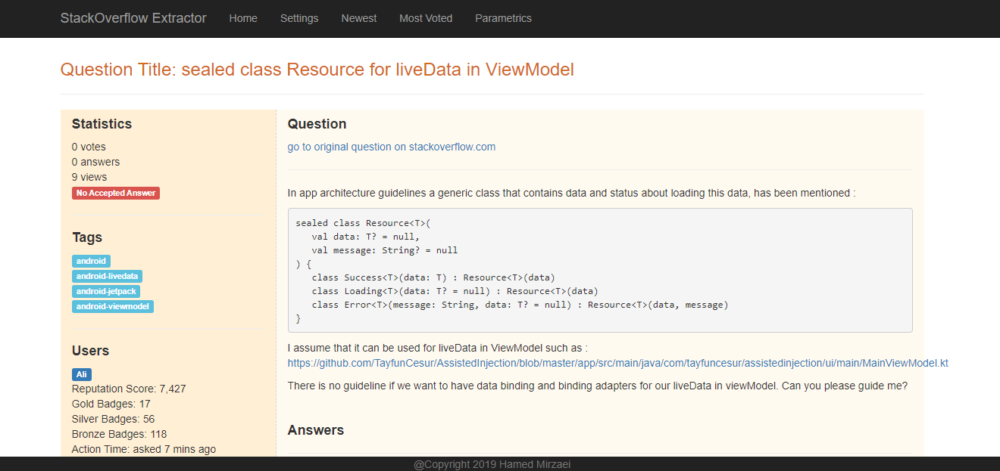

# StackOverflow Question Extractor

This application has been implemented as a programming task for working under supervision of `Prof. Hassan` 
at `Queen's University`. The purpose of the application is to extract top 10 newest and top 10 most voted
`Android` questions from `stackoverflow.com` website.
To make the application more useful, we provided followings:

* Extract and Represent title and summary of top 10 newest questions 
* Extract and Represent title and summary of top 10 most voted questions
* Additional Information included: including question's body and answers, users involved, statistics and tags 


## Requirements
* maven
* java 1.8+

## How to compile and run

### Compile
After cloning the project from GitHub, simply go to the project root and run this:
```
mvn clean package
```
This will package all the project files and dependencies in a single executable jar file names `stackoverflow-extractor-0.0.1-SNAPSHOT.jar` in
the `target` folder of project root directory. For the sake of simplicity, a copy of the jar is placed at `results` 
folder of projects root (in case you don't have `maven`, you can use it).

### Usage
Open a cmd prompt (or terminal) in the place of `stackoverflow-extractor-0.0.1-SNAPSHOT.jar` file and run this:
```
java -jar stackoverflow-extractor-0.0.1-SNAPSHOT.jar
```

It will starts application on `http://localhost:8080` and you can access it through your browser.

Bellow are some images of the web pages:



